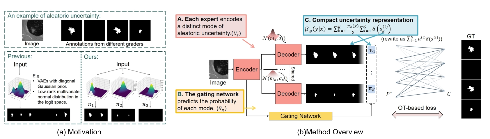

# Modeling Multimodal Aleatoric Uncertainty in Segmentation with Mixture of Stochastic Experts
[](https://www.python.org/) [](https://pytorch.org/docs/1.4.0/) [](LICENSE)

This is the official project repository for [*Modeling Multimodal Aleatoric Uncertainty in Segmentation with Mixture of Stochastic Experts*](https://arxiv.org/pdf/2212.07328.pdf) by Zhitong Gao, Yucong Chen, Chuyu Zhang, Xuming He (ICLR 2023).
- **Other resources:** [OpenReview](https://openreview.net/forum?id=KE_wJD2RK4)  | [Poster](https://gaozhitong.github.io/posters/poster-iclr.pdf) | [Video](https://www.youtube.com/watch?v=SVyqWKnR_pQ)
- **TL;DR:** We propose a novel mixture of stochastic experts (MoSE) model training with a Wasserstein-like loss, which produces an efficient two-level representation for the multi-modal aleatoric uncertainty in semantic segmentation.

# 1. Preparation
## Dataset
We evaluate our method on two public benchmarks, including [LIDC-IDRI dataset](https://wiki.cancerimagingarchive.net/display/Public/LIDC-IDRI) and synthetic multimodal [Cityscapes dataset](https://www.cityscapes-dataset.com/).
Please follow below instructions on how to access and preprocess the data.
### LIDC-IDRI Dataset
1. Download the pre-processed 2D crops provided by [Probabilistic-Unet-Pytorch](https://github.com/stefanknegt/Probabilistic-Unet-Pytorch) in this [link](https://drive.google.com/drive/folders/1xKfKCQo8qa6SAr3u7qWNtQjIphIrvmd5?usp=sharing).
2. Process and arrange the data directory by running [.data/preprocess/lidc_data_loader.py](.data/preprocess/lidc_data_loader.py). You may need to change the path 'data_root' to the directory where
you save the downloaded data.  You also need to define the paths of the processed data. This will generate a hdf5 data package as well as a numpy directory.
In our experiments only the npy data directory is used. You can delete others if you like. 

### Cityscapes Dataset
1. Download the [images](https://www.cityscapes-dataset.com/file-handling/?packageID=3) and original [annotations](https://www.cityscapes-dataset.com/file-handling/?packageID=1) from the official Cityscapes dataset.
2. Set data directories in [.data/preprocess/preprocessing_config.py](data/preprocess/preprocessing_config.py) and run [.data/preprocess/preprocessing.py](data/preprocess/preprocessing.py) to  rescale the data to a resolution of 256 x 512 and save as numpy arrays.
3. Download the black-box predictions provided [here](https://drive.google.com/file/d/1EkJD1PUe7J5f5oc_VvUj-7a7XTT-I-Gc/view) as in [CARSSS](https://drive.google.com/file/d/1EkJD1PUe7J5f5oc_VvUj-7a7XTT-I-Gc/view). 
3. Finally, setup the dataset by running [.data/preprocess/cityscapes_data_loader.py](.data/preprocess/cityscapes_data_loader.py).
This operation will split the training, validation and test set, construct multiple labels and corresponding probabilities. 
You may need to change some data paths in the file to fit your situation.  This will generate a hdf5 data package as well as a numpy directory.
In our experiments only the npy data directory is used. You can delete others if you like.

## Environment
- cuda 10.1
- Follow the instructions to build up the environment setting. This will create a conda environment named 'MoSE'.
```angular2html
conda env create -f env/environment.yaml
conda activate MoSE
```
# 2. Training
After setting up datasets and environment, we are now ready for training.
Set the dataset path in the code. The default dataset path is '../data/lidc_npy' and  '../data/cityscape_npy_5'. You can modify it in the experiments config files. (See ./experiments/)
Select one model to train in models/experiments.
```angular2html
python main.py experiments/lidc_proposed.py
```
### 2.1 Other training options
You can change the Unet backbone with a num_filters to [32, 64, 128, 192] for reproducing a lighter model as shown in our paper.
And you can set 'use_bbpred' to False in cityscapes_proposed.py to run experiments without the black box predictions.

## 3. Test model
To test the model performance, please run the following code. 
```angular2html
python main.py experiments/lidc_proposed.py --demo test
```
- This will find and run the model with best validation GED score of the experiment_name defined in the config file.
- By default, it will do compact inference with sample bumber being num_expert x sample_per_mode. You can change the variable sample_per_mode to 
get results with different sample number in the compact representation. Or you can change the 'eval_sample_num' to some number to get the results in
standard representation. (Eg. set eval_sample_num to be 16, you will get inference results with 16 samples in standard form.) 
### 3.1 Pretrained Models

- The provided pre-trained models can be downloaded as following. We note that we update some slight design of the UNet backbbone according to [ProbUnet-Pytorch](https://github.com/stefanknegt/Probabilistic-Unet-Pytorch). 
The resulting paramers is slightly smaller than the results in the paper. However, the performance remains unchanged. 
(*Results are demonstrated with sample number 16 in standard representation.) 

| Dataset     | Annotation | Download                       | GED(16)  | M-IoU(16) | ECE(%)(16)  | # param.  |
|-------------|------------|--------------------------------|------|-------|------|------|
| LIDC        | Full       | [ckpt](https://drive.google.com/file/d/12JNF7JJ1gwQjrpIMBBZiA7lx_Q9UvYUE/view?usp=sharing) | 0.213 | 0.622   | 0.045 | 37.28 M|
| LIDC        | One        | [ckpt](https://drive.google.com/file/d/1UvcDHpi55NQhlzaeJZDDwocXOCxS8CT4/view?usp=sharing) | 0.243 | 0.599   | 0.096 | 37.28 M|
| Cityscapes  | Full       | [ckpt](https://drive.google.com/file/d/1L8_ED9TRswm1dy1zLerjQXlJdCmHju6j/view?usp=sharing) | 0.178 | 0.641   | 3.260 | 37.32 M|
 
- After you download the ckpt files, please put them in the 'log' directory and arrange the file as follows.
```
.
├── log
│   ├── cityscapes
│   │   ├── cityscapes_pretrained
│   │   │   └── cityscapes_pretrained_best_ged.pth
│   │   └── ...
│   ├── lidc
│   │   ├── lidc_pretrained
│   │   │   └── lidc_pretrained_best_ged.pth
│   │   ├── lidc_pretrained_1annot
│   │   │   └── lidc_pretrained_1annot_best_ged.pth
│   │   └── ...
```
- Then just follow previous instruction on testing model to do inference. You should get roughly similar results as in the table
when you set eval_sample_num to 16.

## Updates
- 03/01/2023 Upload evluation metrics.
- 04/29/2023 Upload the complete code.  
- 06/27/2023 Upload pretrained model files, refine some codes and README.